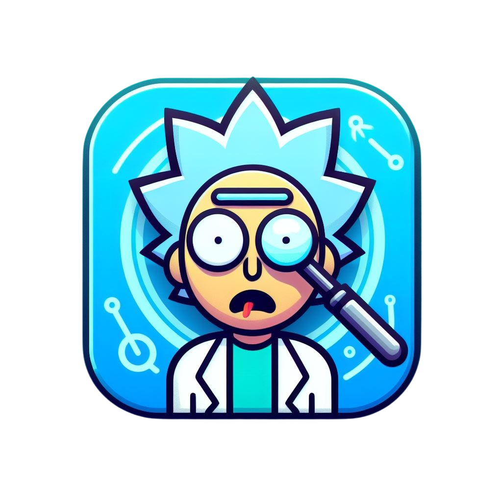
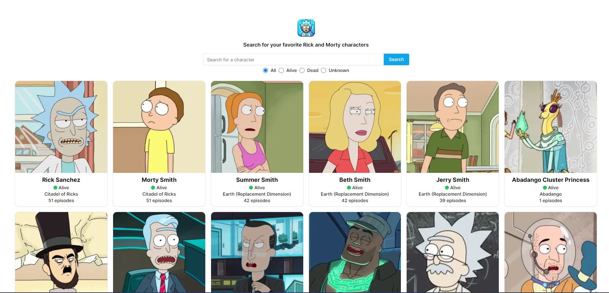

<!-- PROJECT SHIELDS -->

[![Contributors][contributors-shield]][contributors-url]
[![Forks][forks-shield]][forks-url]
[![Stargazers][stars-shield]][stars-url]
[![Issues][issues-shield]][issues-url]
[![LinkedIn][linkedin-shield]][linkedin-url]

<!-- PROJECT LOGO -->
<br />
<p align="center">
  <a href="https://github.com/DevGabrielSouza/rick-and-morty/">
    
  </a>

  <h3 align="center">Rick and Morty Character Search</h3>

  <p align="center">
    Rick and Morty Character Search" is a web application built with Next.js and the Rick and Morty API. This application allows users to search for their favorite characters from the popular TV show "Rick and Morty". The application provides detailed information about each character, including their appearances in episodes, their species, and their status.
    <br />
    <br />
    <a href="https://rick-and-morty.devgabrielsouza.com.br" target="_blank">View Demo (Visit Site) </a>
    ·
    <a href="https://github.com/DevGabrielSouza/rick-and-morty/issues">Report Bug</a>
    ·
    <a href="https://github.com/DevGabrielSouza/rick-and-morty/issues">Request Feature</a>
  </p>
</p>

<!-- TABLE OF CONTENTS -->
<details open="open">
  <summary>Table of Contents</summary>
  <ol>
    <li>
      <a href="#about-the-project">About The Project</a>
      <ul>
        <li><a href="#built-with">Built With</a></li>
      </ul>
    </li>
    <li>
      <a href="#getting-started">Getting Started</a>
      <ul>
        <li><a href="#prerequisites">Prerequisites</a></li>
        <li><a href="#installation">Installation</a></li>
      </ul>
    </li>
    <li><a href="#roadmap">Roadmap</a></li>
    <li><a href="#contributing">Contributing</a></li>
    <li><a href="#license">License</a></li>
    <li><a href="#contact">Contact</a></li>
    <li><a href="#acknowledgements">Acknowledgements</a></li>
  </ol>
</details>

<!-- ABOUT THE PROJECT -->

## About The Project



### Built With

-   [Next](https://nextjs.org/)
-   [Rick And Morty API](rickandmortyapi.com/)

<!-- GETTING STARTED -->

## Getting Started

This is an example of how you may give instructions on setting up your project locally.
To get a local copy up and running follow these simple example steps.

### Prerequisites

#### NodeJS

-   For Linux users:
    ```sh
    sudo apt-get install nodejs
    ```
-   For Windows users:
    Download the Node.js installer from the [official website](https://nodejs.org/en/download/).

#### npm

-   For Linux users:

    ```sh
    sudo npm install npm@latest -g
    ```

-   For Windows users:
    npm is distributed with Node.js - which means that when you download Node.js, you automatically get npm installed on your computer.

### Installation

1. Clone the repo
    ```sh
    git clone https://github.com//DevGabrielSouza/rick-and-morty.git
    ```
2. Install packages
    ```sh
    npm install
    ```
3. Run the project
    ```sh
    npm run dev
    ```

<!-- ROADMAP -->

## Roadmap

See the [open issues](https://github.com/DevGabrielSouza/rick-and-morty/issues) for a list of proposed features (and known issues).

<!-- CONTRIBUTING -->

## Contributing

Contributions are what make the open source community such an amazing place to be learn, inspire, and create. Any contributions you make are **greatly appreciated**.

1. Fork the Project
2. Create your Feature Branch (`git checkout -b feature/AmazingFeature`)
3. Commit your Changes (`git commit -m 'Add some AmazingFeature'`)
4. Push to the Branch (`git push origin feature/AmazingFeature`)
5. Open a Pull Request

<!-- CONTACT -->

## Contact

Dev Gabriel Souza - [Linkedin](https://www.linkedin.com/in/devgabrielsouza/) - contato@devgabrielsouza.com.br

Project Link: [Rick And Morty Character Search](https://rick-and-morty.devgabrielsouza.com.br/)

<!-- ACKNOWLEDGEMENTS -->

## Acknowledgements

-   [Next](https://nextjs.org/docs)
-   [Rick And Morty API](https://rickandmortyapi.com/documentation)

<!-- MARKDOWN LINKS & IMAGES -->
<!-- https://www.markdownguide.org/basic-syntax/#reference-style-links -->

[contributors-shield]: https://img.shields.io/github/contributors/DevGabrielSouza/rick-and-morty.svg?style=for-the-badge
[contributors-url]: https://github.com/DevGabrielSouza/rick-and-morty/graphs/contributors
[forks-shield]: https://img.shields.io/github/forks/DevGabrielSouza/Best-README-Template.svg?style=for-the-badge
[forks-url]: https://github.com/DevGabrielSouza/rick-and-morty/network/members
[stars-shield]: https://img.shields.io/github/stars/DevGabrielSouza/Best-README-Template.svg?style=for-the-badge
[stars-url]: https://github.com/DevGabrielSouza/rick-and-morty/stargazers
[issues-shield]: https://img.shields.io/github/issues/DevGabrielSouza/Best-README-Template.svg?style=for-the-badge
[issues-url]: https://github.com/DevGabrielSouza/rick-and-morty/issues
[linkedin-shield]: https://img.shields.io/badge/-LinkedIn-black.svg?style=for-the-badge&logo=linkedin&colorB=555
[linkedin-url]: https://www.linkedin.com/in/devgabrielsouza/
[product-screenshot]: public/app_screenshot.jpg
